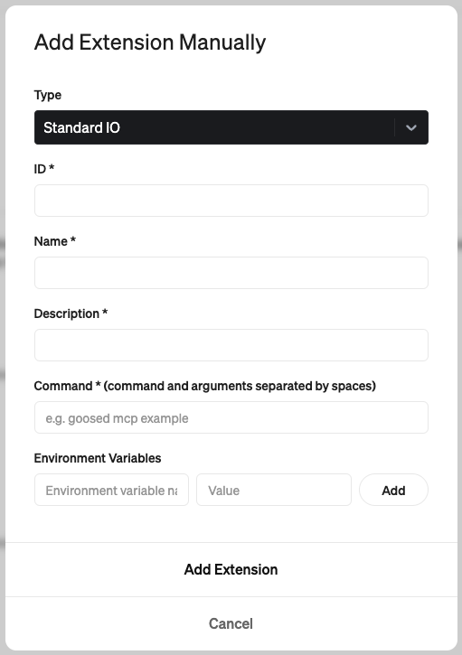

# VSCode MCP

This monorepo contains the VSCode MCP Server and its companion VSCode Extension, which together enable AI agents and assistants, like Goose or Claude, to interact with VSCode through the Model Context Protocol.

## Project Structure

```
vscode-mcp/
├── server/    # MCP server implementation
└── extension/ # VS Code extension
```

## Quick Start

1. Install the MCP Server

```bash
npx vscode-mcp-server install
```

2. Install the MCP Extension

> [MCP Extension](https://marketplace.visualstudio.com/items?itemName=block.vscode-mcp-extension)

## Configuration

### Goose Desktop Setup



- ID: `code-mcp`
- Name: `VS Code`
- Description: `Allows interaction with VS Code through the Model Context Protocol`
- Command: `npx vscode-mcp-server`

### Claude Desktop Setup

Add this to your Claude Desktop config file (`~/Library/Application Support/Claude/claude_desktop_config.json`):

```json
{
  "mcpServers": {
    "vscode-mcp-server": {
      "command": "npx",
      "args": ["vscode-mcp-server"],
      "env": {}
    }
  }
}
```

## Available Tools

The Code MCP server provides the following tools for AI agents to interact with VS Code:

### `create_diff`

Creates and shows a diff for modifying existing files:

- Shows changes preview before applying
- Requires user approval
- Only works with existing files

### `open_file`

Opens files in the VS Code editor:

- Used for viewing new or modified files

### `open_project`

Opens a project folder in VS Code:

- Sets up working directory for AI agent

### `check_extension_status`

Checks if extension is installed and responding

### `get_extension_port`

Gets the port number for VS Code MCP Extension

### `list_available_projects`

Shows projects from port registry file

## License

This project is licensed under the Apache License 2.0 - see the [LICENSE](LICENSE) file for details.

Copyright 2025 Block, Inc.

This product includes software developed at [Block, Inc.](https://block.xyz/)
